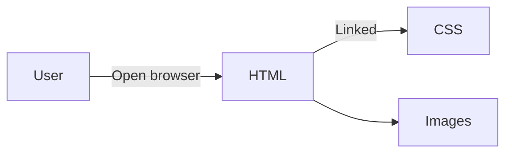

## 🔗 Live Preview
[Click here to view the live project](https://razahussaindev.github.io/figma-to-code-assignment/)

# Figma to Code Assignment

## Learning Objective

This project is a beginner-level assignment to practice turning a simple Figma design into a real web page using HTML and CSS. The main goals were:

- Understanding the basics of HTML structure
- Learning how to link CSS for styling
- Practicing layout and positioning with CSS
- Using images in a web project
- Following a design reference (from Figma)

## Technologies Used

- **HTML5** (structure)
- **CSS3** (styling)
- Basic image handling

## Features

- Simple and clean web page layout
- Responsive elements (basic)
- Images included from a local folder
- Styles and structure match a Figma design reference

## Folder Structure

```
.
├── images/       # Contains image files used in the project
├── index.html    # Main HTML file for the page
└── style.css     # CSS file for styles and layout
```

## How to Open / Run the Project

1. **Download or Clone this Repository:**
   - Click "Code" > "Download ZIP" or use `git clone` if you know how.

2. **Open `index.html` in Your Browser:**
   - Double-click the `index.html` file, or right-click and select "Open with" > your web browser.

3. Make sure the folder structure stays the same, especially the `images` folder, so images show up properly.

## Notes

- This is a learning practice assignment, not a finished or professional product.
- Comments in the code may help explain some parts.
- If you're a beginner, try changing some styles in `style.css` or editing the HTML to see what happens!

## Future Learning Goals (Optional)

- Explore adding more pages and navigation.
- Practice with CSS Flexbox or Grid for more complex layouts.
- Learn about making pages more responsive for mobile.
- Start using JavaScript for interactive elements.

---

### Simple Project Flow


